# Mobile app supporting the teaching process

As part of the project, a mobile application supporting the individual teaching process was designed and implemented. The application integrates the needs of three user groups: parents, tutors and students, providing a comprehensive tool for managing the educational process. The system enables managing relationships between participants in the teaching process, monitoring student progress through a reporting system, and communication between users. The application was developed using modern technologies such as Swift, SwiftUI and Firebase. The application is a response to the growing demand in the tutoring market for digital solutions supporting the organization of the teaching process and communication between all involved parties.

## Application in Action

After launching the application, a clear and intuitive login interface is displayed (Figure 1). The screen is characterized by simplicity and readability, offering the user two primary paths: logging in to an existing account or registering a new one. The system includes an advanced input validation mechanism that continuously informs the user of potential errors. If incorrect login data is entered, the system displays clear messages indicating the nature of the error.

For new users, the registration process (Figure 2) has been designed to collect all necessary user information. At this stage, it is crucial to specify the user’s role – it can be either a parent or a tutor. The system does not allow direct registration for students. Their accounts are created and managed solely by parents, providing an additional layer of control and security.

| 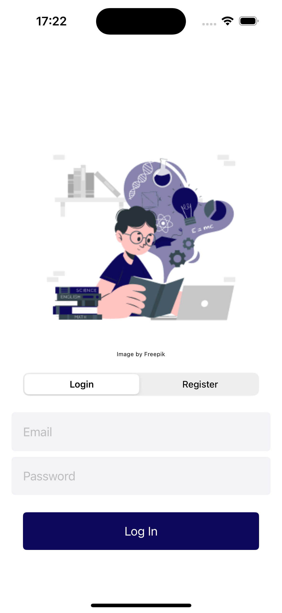 | 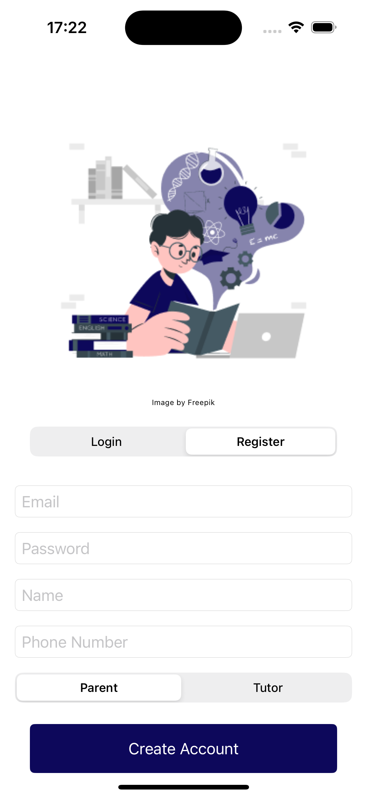 |
|:---:|:---:|
| **Figure 1.** Login Screen | **Figure 2.** Registration Screen |

Once successfully logged in or registered, the user is taken to the main view, which differs based on their role. For a parent, this is the “People” tab (Figure 3), acting as the main hub for managing the educational process. This is where the parent can begin building the child’s network of contacts.

The system offers a flexible approach to adding children – the parent can either create a new account (Figure 4) or connect to an existing child’s profile, which was previously created by another parent.

| 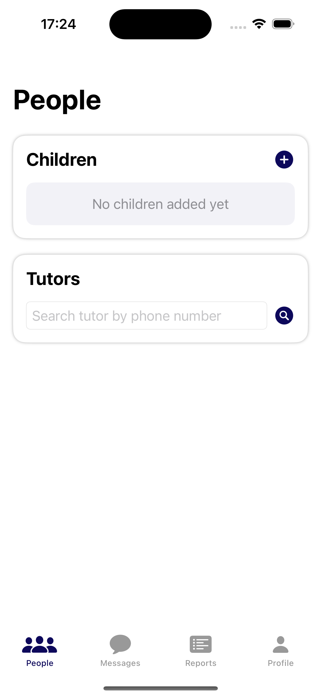 | 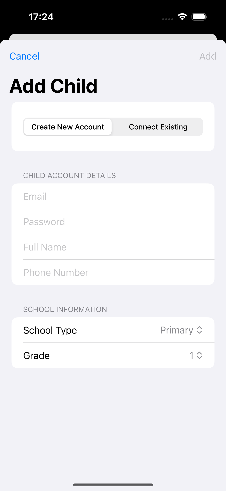 |
|:---:|:---:|
| **Figure 3.** Parent’s Main View | **Figure 4.** Creating a Child’s Account |

The process of creating a new child’s profile has been carefully thought out to gather all essential information about the child (Figure 5). The parent fills out a form that includes not only basic personal data but also details about the child’s educational level, such as the type of school and class. If connecting to an existing child’s account (Figure 6), the verification process requires providing basic authentication data – email address and password. In both cases, once the process is successfully completed, the child appears in the “Children” section automatically.

| 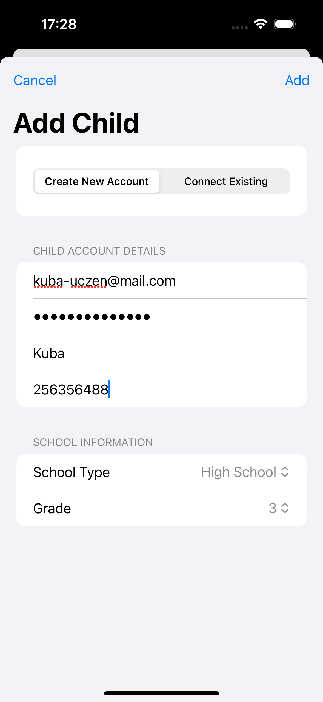 | 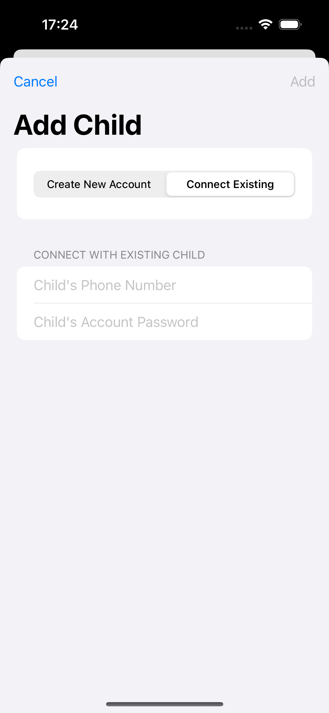 |
|:---:|:---:|
| **Figure 5.** Creating a Child’s Account – Detailed Process | **Figure 6.** Connecting to an Existing Child’s Account |

Another key element in organizing the learning process is establishing a collaboration with a tutor. The system offers a simple mechanism for searching for a teacher by phone number (Figure 7). After locating the appropriate tutor, the parent proceeds to select which children will be involved in the lessons (Figure 8). This is especially convenient for families where multiple children share the same tutor. Once the process is complete, the system displays a confirmation of the invitation being sent (Figure 9), and the tutor’s profile appears in the “Tutors” tab with a pending acceptance status.

| 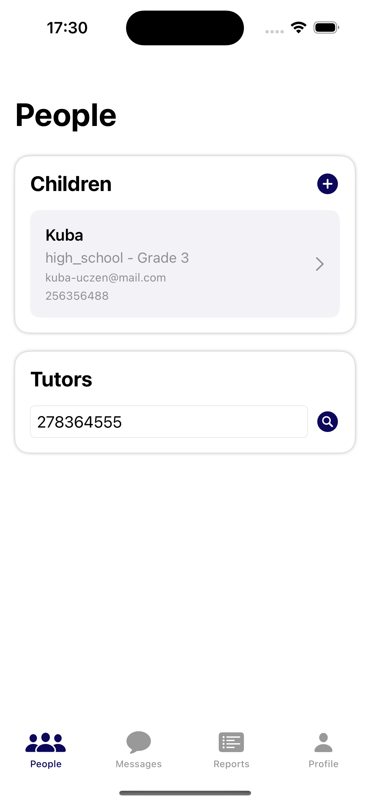 | 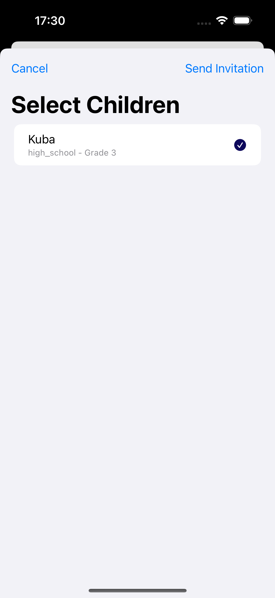 | 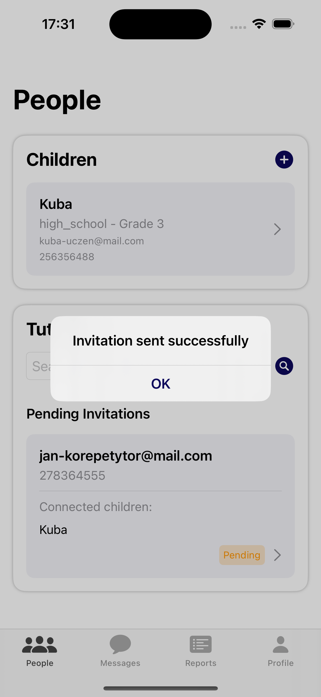 |
|:---:|:---:|:---:|
| **Figure 7.** Searching for a Tutor | **Figure 8.** Selecting Children for the Tutor | **Figure 9.** Invitation Sent Successfully |

From the tutor’s perspective, the process starts with the main view, which presents two key sections: the list of invitations received from parents and the list of active students (Figure 10). The interface is designed to provide quick access to essential information and to enable effective management of student relationships.

The invitations section displays all pending collaboration proposals. Each invitation contains the necessary details – the child’s name, educational level, and the parent’s contact data – allowing the tutor to make an informed decision to accept or reject the cooperation offer. The system presents this information in a clear way, grouping it into readable cards with clearly marked buttons to accept or decline the invitation.

Once an invitation is accepted, several automated processes occur. First, the student is added to the list of active students (Figure 11), granting access to the full functionality related to managing the educational process. In the active students section, the tutor can view detailed information about each student, including their educational profile and the parents’ contact information.

| 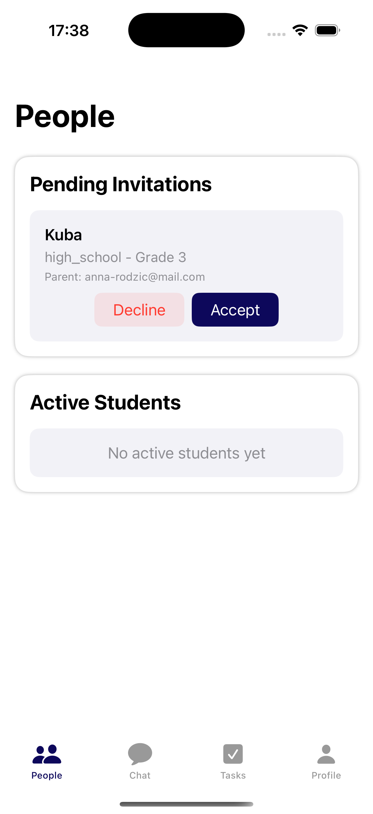 | 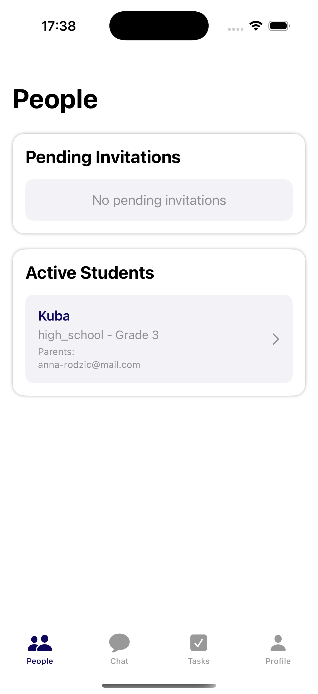 |
|:---:|:---:|
| **Figure 10.** Tutor’s Main View | **Figure 11.** List of Active Students |

The reporting system is one of the most important elements of the application, enabling detailed monitoring of a student’s progress. It is a key tool that ensures effective communication between the tutor and the parents, as well as systematic tracking of educational development. By selecting a student from their list, the tutor has access to the history of all reports and can create new reports (Figure 12). The interface presents the reports in chronological order, allowing for a quick overview of the teaching history.

The report creation process (Figure 13) is designed to collect comprehensive information about the lesson. The tutor provides the date, topic, and duration of the class using a clear form. A particularly important element is the student assessment system, where the tutor assigns points on a scale of 1 to 5 in two key categories: preparation for the lesson and engagement during the lesson. These scores are visualized with an interactive slider, facilitating their assignment and ensuring visual consistency.

Additionally, each report includes a section for detailed notes and recommendations for the parents, where the tutor can describe areas requiring additional work, observed progress, or suggestions for further study. These reports are then available to parents in the dedicated “Reports” tab (Figure 14), providing full transparency of the teaching process and enabling quick responses to emerging educational challenges.

| 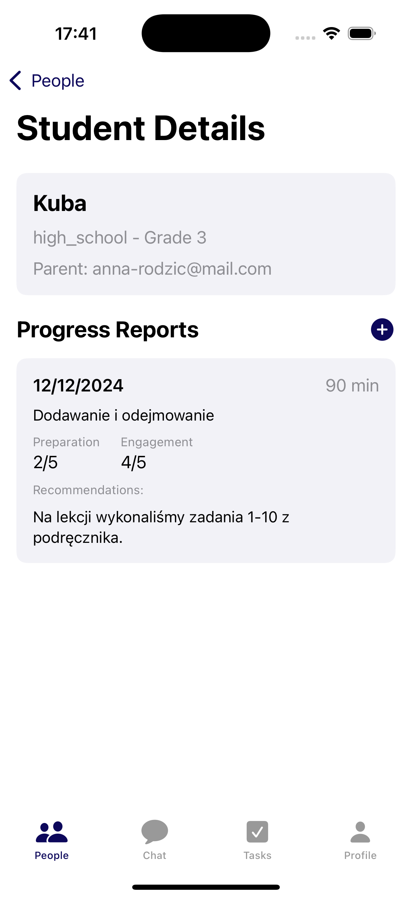 | 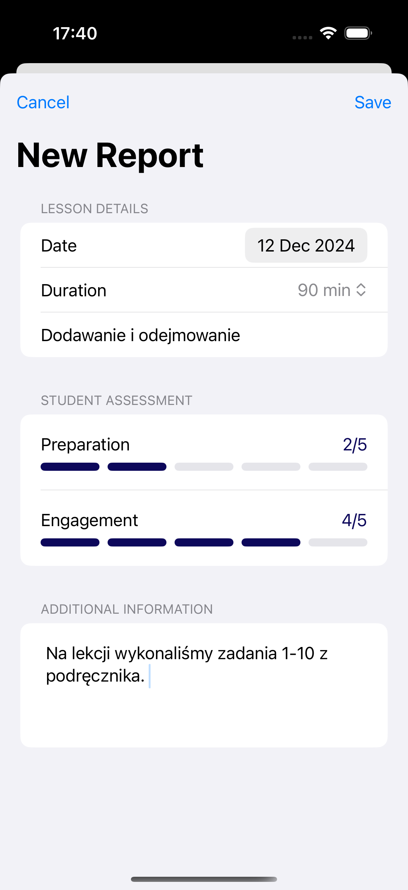 | 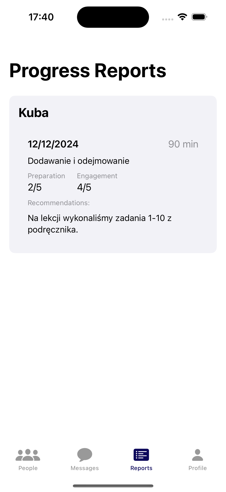 |
|:---:|:---:|:---:|
| **Figure 12.** Tutor’s Report View | **Figure 13.** Creating a Report | **Figure 14.** Parent’s Report View |

The application offers an extensive task management system, which is crucial for supporting the learning process between lessons. The tutor can create detailed tasks (Figure 15) using a comprehensive form. When creating a new task, the system requires providing a title, a detailed description, and a due date.

The system offers flexible assignment options. Tasks can be assigned to a single student or an entire group, which is particularly useful when conducting lessons for students at the same educational level.

From the student’s perspective, all assigned tasks are displayed in the dedicated “Tasks” tab, along with a clear indication of the due date (Figure 16).

| 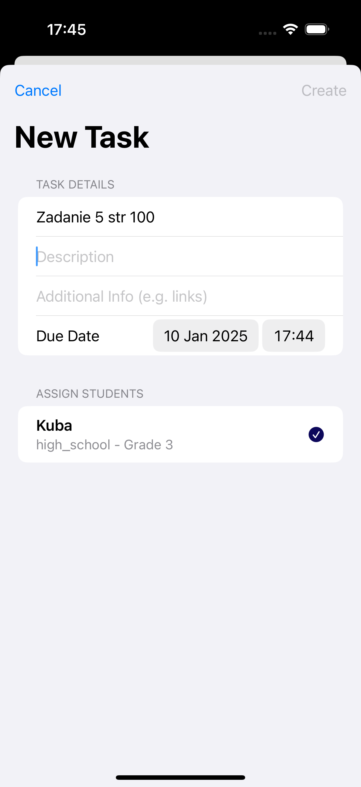 | 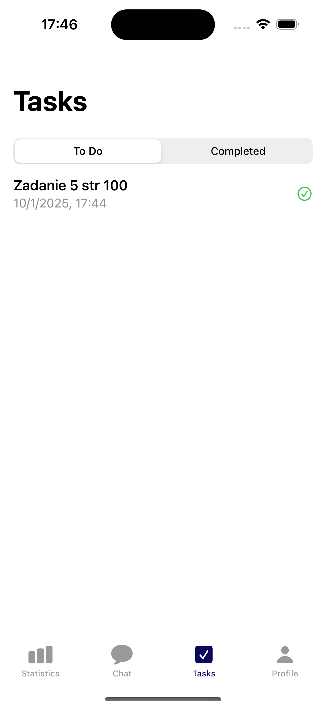 |
|:---:|:---:|
| **Figure 15.** Creating a New Task | **Figure 16.** Student’s Task View |

When a student marks a task as completed, the system asks for confirmation (Figure 17) to prevent accidental markings.

After confirming completion, tasks are automatically moved to the “Completed” section (Figure 18), creating a chronological record of finished activities. This section is designed with a clear layout to showcase the student’s achievements, making it easy to track learning progress.

|  | 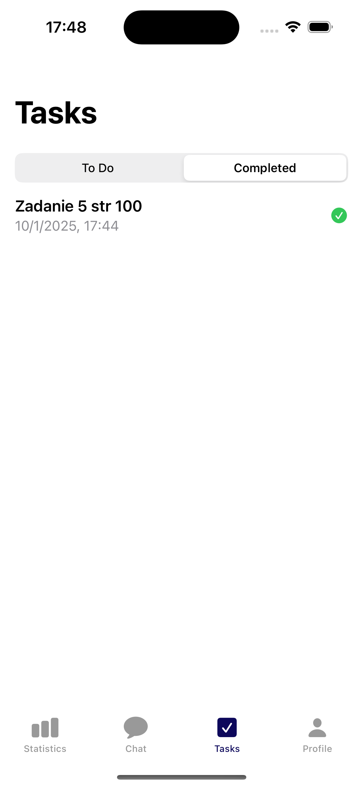 |
|:---:|:---:|
| **Figure 17.** Marking a Task as Completed | **Figure 18.** List of Completed Tasks |

The motivational aspect of learning is supported by a statistics system (Figure 19), which presents the student’s progress in an accessible format. The statistics interface is divided into three key sections: information about the next task’s due date, basic performance indicators, and a weekly activity chart. The bar chart shows how many tasks were completed on each day of the week, allowing the student to quickly evaluate their consistency in studying.

Communication among all participants in the educational process is facilitated through the built-in chat system (Figure 20), enabling swift and direct information exchange. Thanks to this feature, the user can communicate with connected users (Figure 21).

| 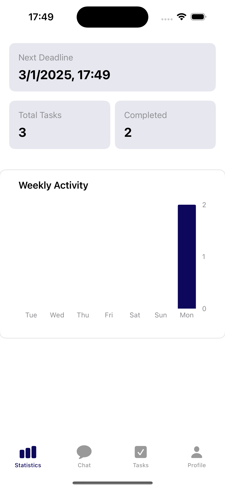 | 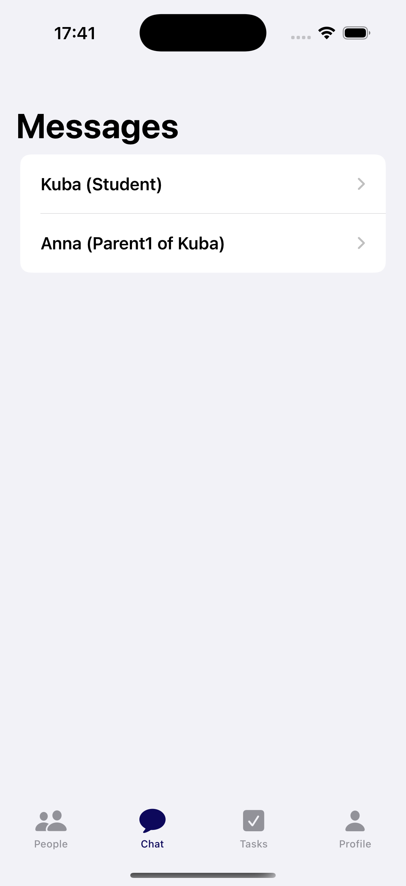 | 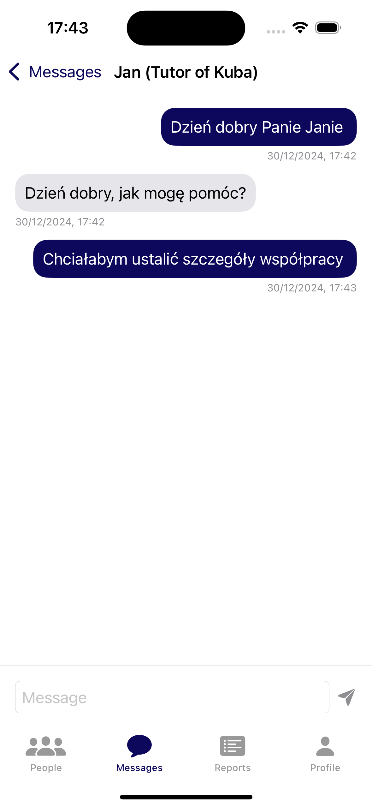 |
|:---:|:---:|:---:|
| **Figure 19.** Student’s Statistics | **Figure 20.** Chat View | **Figure 21.** Parent-Tutor Conversation |

The system also provides the ability to manage user profiles, taking into account security and data privacy aspects. Parents and tutors have access to an intuitive profile editing interface (Figure 22). It allows them to modify basic contact and personal information. The profile editing screen includes data validation, for example by checking the phone number format and its uniqueness in the system.

For student profiles, editing is restricted exclusively to parents (Figure 23). Parents can modify not only the child’s basic personal details but also their educational information, such as the type of school or current class. Any change to a child’s profile is automatically synchronized with the system and visible to linked tutors, ensuring data consistency throughout the system.

| 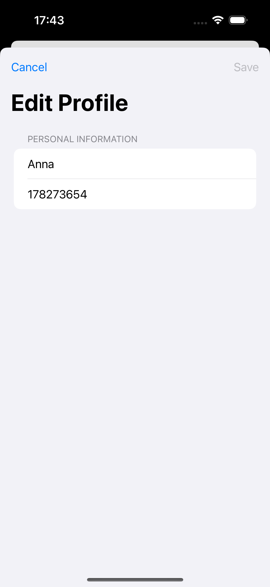 | 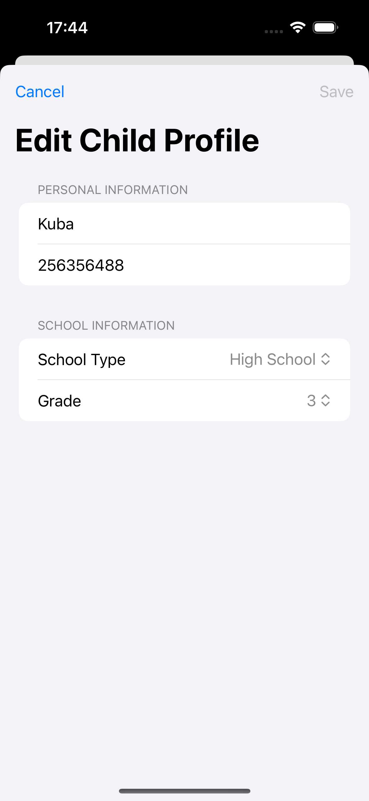 |
|:---:|:---:|
| **Figure 22.** Editing a Parent/Tutor Profile | **Figure 23.** Editing a Child’s Profile |
